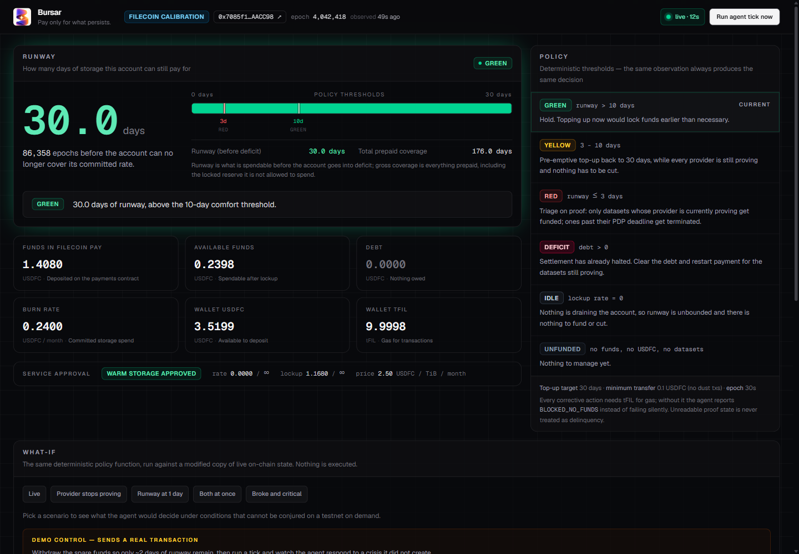
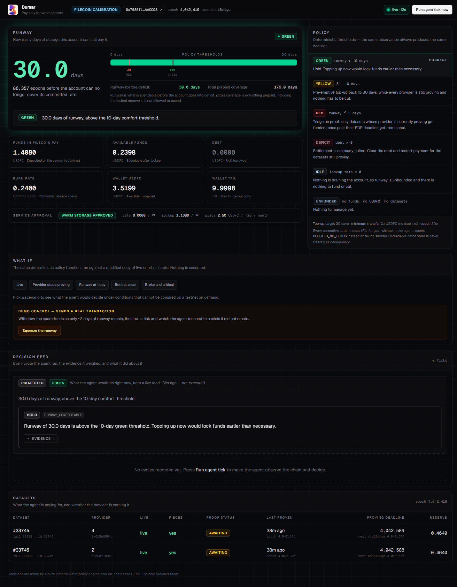
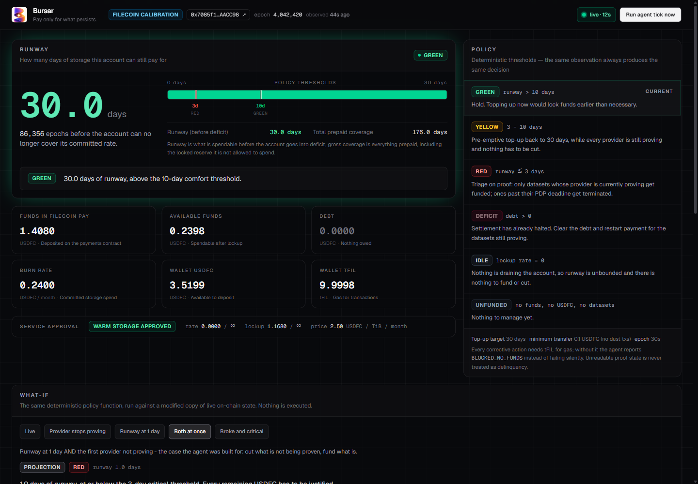
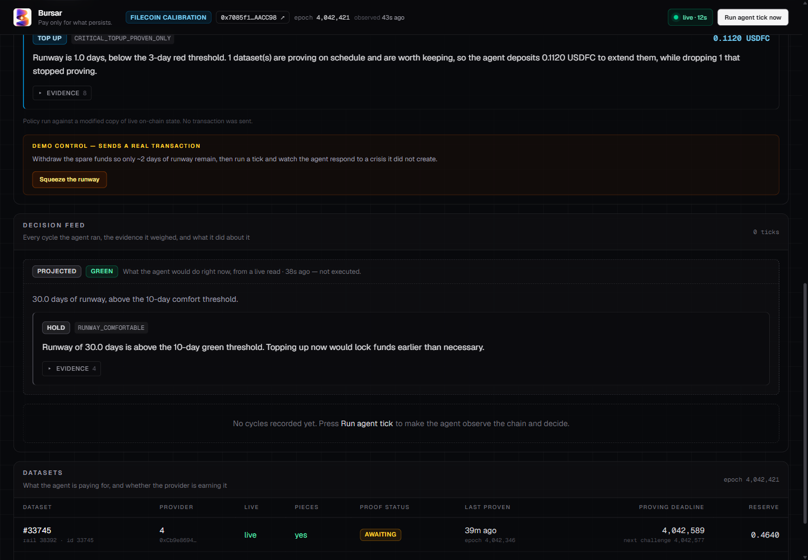
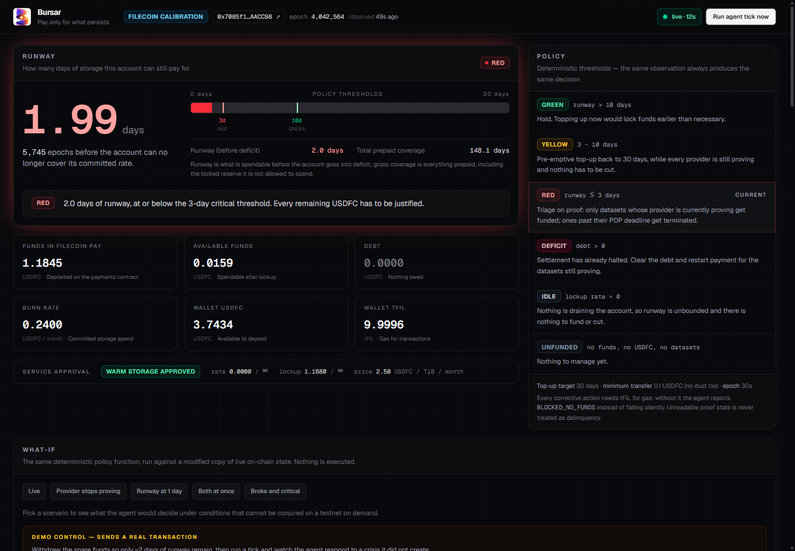

<p align="center"></p>

# Bursar

### Pay only for what persists.

**An autonomous agent that reads its own on-chain balance on Filecoin Pay and decides whether its storage is still worth paying for.**

### ▶ **Live demo: https://bursar-mu.vercel.app**

Submission for the [FilecoinTLDR Builder Challenge — Cycle 4](https://filecointldr.io/).

> The decision is the product, not the transaction.

The dashboard reads live Calibration state on every load. Press **Run agent tick now** to make it decide and transact in front of you; press **Squeeze runway** to withdraw its reserves and watch it handle a real crisis.

---

## What it actually does

Every tick, with no human involved, the agent:

1. **Observes** its own financial position on Filecoin Pay — funds, locked reserve, debt, burn rate, and `runwayInEpochs` (how long before it can no longer pay).
2. **Observes** whether each storage provider it pays is *actually doing the work*, by reading the PDP proving record on-chain.
3. **Decides** which tier it is in and what to do about it — using a pure, deterministic policy function.
4. **Acts** — deposits USDFC, terminates a rail, or deliberately does nothing.
5. **Records** the decision with the evidence that produced it, and has an LLM narrate it in plain English.

The interesting part is step 3, and specifically what happens when money gets tight.

### The core decision

Most "agent + storage" demos top up when a number gets low. This one asks a harder question: **when you can't afford everything, what do you keep?**

The agent chains a *second* on-chain primitive into the budget decision — **PDP proof status**:

| Runway | What the agent does |
|---|---|
| **> 10 days** (GREEN) | Hold. Explicitly declines to top up — locking funds early has a cost. |
| **3–10 days** (YELLOW) | Top up pre-emptively to 30 days, while everything is still healthy and nothing has to be cut. |
| **≤ 3 days** (RED) | **Triage.** For each dataset, check whether the provider has actually proven possession this period. Providers past their PDP deadline get their rail **terminated** — they are charging for work they have not done. Only the datasets that are genuinely being proven get funded, and the top-up is re-sized down to match what survives. |
| **debt > 0** (DEFICIT) | Settlement to providers has already halted. Clear the debt first. |

Two refusals matter as much as the actions:

- **If proof state can't be read, the agent does *not* prune.** Unknown is not the same as delinquent — it will not destroy data because an RPC call hiccupped.
- **If the wallet is empty and every provider is proving, the agent escalates rather than cutting.** There is nothing it can honestly justify deleting.

---

## Judge's walkthrough — 90 seconds

The agent is deployed, funded, and holding live datasets right now. You do not
need to run anything.

1. **Open https://bursar-mu.vercel.app.** Note the runway meter and the tier
   chip. Every number on the page is a contract call made when the page loaded.
2. **Read the tier reason.** In GREEN the agent is explicitly *declining* to
   top up — refusing to act is a decision, and it says why.
3. **Click "Squeeze the runway."** This sends a **real withdrawal transaction**
   that takes the agent's spare funds away. Wait ~20s for it to confirm; the
   runway collapses from ~30 days to ~2.
4. **Click "Run agent tick now."** Watch it observe, classify itself RED, check
   the PDP proving record for every provider it pays, and then deposit USDFC —
   **signing and sending that transaction itself.** The decision card links to
   the tx on Filfox.
5. **Open the "Both at once" what-if scenario.** This runs the same
   deterministic policy against live state with one provider marked delinquent,
   and shows the branch that makes this more than a top-up bot: it terminates
   the non-proving provider's rail and re-sizes the deposit for what survives.

Expand any **EVIDENCE** block to see the exact on-chain values that produced a
decision.

---

## Proof it works — live on Filecoin Calibration

Agent wallet: [`0x7085f12a9B5e51dD9B01443F7568A2De40AACC98`](https://calibration.filfox.info/en/address/0x7085f12a9B5e51dD9B01443F7568A2De40AACC98)
— every transaction below is on that address and independently verifiable.

A real, unedited run:

```
runway  7.00 days  →  YELLOW  →  TOP_UP 0.184011 USDFC  →  30.00 days  →  GREEN  →  HOLD
runway  1.99 days  →  RED     →  verified both providers still proving
                              →  TOP_UP 0.224014 USDFC  →  30.00 days  →  GREEN
```

### Verified transactions

| What | Transaction |
|---|---|
| Deposit + operator approval | [`0x94e2b59f…d518cb2`](https://calibration.filfox.info/en/message/0x94e2b59f48033fc8a872f7040315180dbbb3d38c346d24956c92b0b24d518cb2) |
| **Agent's autonomous top-up** (YELLOW → 30d) | [`0xbf3843c4…55b225c5`](https://calibration.filfox.info/en/message/0xbf3843c4e3ada0a41349ab05174fbfd78f2ccf88f74526ad0c5ab24c55b225c5) |
| **Agent's autonomous top-up** (RED, proof-verified) | [`0x94c9e429…144496ab`](https://calibration.filfox.info/en/message/0x94c9e42917f8e2d65b0353d756a33153ba7b1cfe00d87bf456f59258144496ab) |
| **Agent's autonomous top-up** (RED, later cycle) | [`0x2b6a749c…bc00c0f1`](https://calibration.filfox.info/en/message/0x2b6a749c901842bde9e3277f161987145f9a316ec53b70df4f1041a0bc00c0f1) |
| **Rail termination — the prune path** | [`0x0e6a1757…f9f1ae04`](https://calibration.filfox.info/en/message/0x0e6a1757fa0d2f585a4916457b55e4236f97e8d85548e48068a7245ef9f1ae04) |
| Withdrawal that created the crisis (demo control) | [`0x793ad56d…93b7a85f`](https://calibration.filfox.info/en/message/0x793ad56d7223e4f07f19a26a9ea3f6d452e662f0746d55c83a003fee93b7a85f) |

| | |
|---|---|
| Datasets it pays for | `33745` (provider 4), `33746` (provider 2) — both currently proving |
| Stored PieceCID | `bafkzcibd54aqi36xewuc4tpkpnvelrkdipczelblkzhmi7cosc4lv2xqgw343dil` |
| Terminated dataset | `33779` (provider 9), `endEpoch` 4042585 |

### On the termination proof

The RED-tier prune only fires when a provider genuinely misses its PDP deadline,
which cannot be arranged on demand. So rather than claim the path works,
`scripts/prove-terminate.mjs` exercises **the same `terminateService()` call
`lib/agent/act.ts` makes for `PRUNE_DATASET`**, against a **disposable dataset
created for the purpose** — the datasets the demo depends on are never at risk,
because termination is one-way. The transaction above is the result.

Nothing here is mocked. Every number the agent reasons about is read from a live
contract call at decision time, and you can check any of these hashes yourself.

---

## How Filecoin is used

This is not "Filecoin as a hidden backend." The Filecoin primitives *are* the decision inputs.

| Primitive | Contract (Calibration) | What the agent reads/does |
|---|---|---|
| **Filecoin Pay** | `0x09a0fDc2723fAd1A7b8e3e00eE5DF73841df55a0` | `accountSummary()` → `runwayInEpochs`, `availableFunds`, `debt`, `lockupRatePerEpoch`. This *is* the agent's sense of its own mortality. |
| **PDP Verifier** | `0x85e366Cf9DD2c0aE37E963d9556F5f4718d6417C` | `getDataSetLastProvenEpoch()`, `getNextChallengeEpoch()`, `dataSetLive()` — the recorded proof history. |
| **Warm Storage (FWSS)** | `0x02925630df557F957f70E112bA06e50965417CA0` | `provenThisPeriod()`, `provingDeadline()` — is this provider earning its money *right now*? Plus `terminateService()` to cut a rail. |
| **USDFC** | `0xb3042734b608a1B16e9e86B374A3f3e389B4cDf0` | The currency of every decision. |
| **Synapse SDK** | `@filoz/synapse-sdk@2.0.0` | Client for all of the above. |

Contract addresses are **read from the SDK's chain object at runtime**, never hardcoded.

The agent even **funds itself**: on Calibration it claims from the faucet API programmatically, so there is no human funding step at all.

---

## Architecture

The most important design decision: **the LLM does not decide anything.**

```
observe()  ──►  decide()  ──►  execute()  ──►  journal
   │              │               │
 on-chain    pure function    real txs
  reads      (no I/O, no       (deposit /
             clock, no RNG)    terminate)
                  │
                  └──►  narrate()  ← LLM runs HERE, after the fact
```

`lib/agent/policy.ts` is a pure synchronous function: same observation in, same decisions out. It is auditable, unit-testable, and cannot be talked out of its judgement by a hallucination. The LLM (Groq) receives the decision *after* it has already been made and executed, and writes the human-readable summary.

This matters because the agent spends real money. A model that is wrong should produce a worse *sentence*, never a worse *transaction*.

| File | Role |
|---|---|
| `lib/agent/observe.ts` | Reads all on-chain state. Makes no judgements. |
| `lib/agent/policy.ts` | **The product.** Pure decision function. |
| `lib/agent/act.ts` | Maps decisions to real transactions. |
| `lib/agent/narrate.ts` | LLM explanation layer (Groq, Anthropic fallback). |
| `lib/agent/journal.ts` | Append-only decision history. |
| `lib/agent/tick.ts` | The autonomous loop. |
| `lib/agent/config.ts` | Every threshold, in one readable place. |

---

## Endpoints

| Route | Purpose |
|---|---|
| `GET /api/agent/state` | Live on-chain state **plus what the policy would do** — without executing. This is what the dashboard polls. |
| `POST /api/agent/tick` | Run one full cycle: observe → decide → **act on-chain** → journal. |
| `GET /api/cron/tick` | The autonomy entry point. Vercel Cron calls this on a schedule. |
| `GET /api/agent/journal` | Full decision history. |
| `GET /api/agent/simulate?scenario=…` | Runs the **real** policy against a **modified copy** of live state. No transactions. |
| `POST /api/demo/squeeze` | Demo control: withdraws funds to create a genuine low-runway crisis. |

### On the simulator — an honesty note

Some branches depend on a provider *actually* missing its PDP deadline, which cannot be conjured on demand. Rather than fake on-chain state, `/api/agent/simulate` takes the genuine live observation, perturbs one field, and runs the **same deterministic `decide()` function** used in production. It is clearly labelled a projection and sends no transactions.

Scenarios: `live`, `provider-delinquent`, `runway-critical`, `critical-and-delinquent`, `wallet-empty`.

Real output from `critical-and-delinquent`:

```
TIER: RED — 1.0 days of runway, at or below the 3-day critical threshold.

  PRUNE_DATASET [PROVIDER_NOT_PROVING] dataset 33745
    Provider 4 is 312 epochs past the PDP proving deadline for dataset 33745
    and runway is down to 1.0 days. It is taking payment for possession it has
    not proven, so the agent terminates this rail instead of funding it.

  TOP_UP [CRITICAL_TOPUP_PROVEN_ONLY] 0.112000 USDFC
    1 dataset(s) are proving on schedule and are worth keeping, so the agent
    deposits 0.1120 USDFC to extend them, while dropping 1 that stopped proving.
```

Note the top-up is **0.112**, not the 0.232 it would have needed to fund both — the agent re-sized the deposit for only what survived triage.

---

## Running it

```bash
npm install
cp .env.local.example .env.local     # then fill in the values below
npm run dev
```

Environment:

```bash
AGENT_PRIVATE_KEY=0x…      # the agent's own wallet (Calibration testnet only)
GROQ_API_KEY=gsk_…         # optional — narration only, never decisions
CRON_SECRET=…              # optional — protects /api/cron/tick in production
```

Give the agent something to pay for:

```bash
PK=0x… node scripts/bootstrap-storage.mjs
```

This deposits USDFC, approves Warm Storage as operator, and uploads a payload — starting a real PDP payment rail. `EXTRA_RUNWAY_EPOCHS` controls the starting runway (default 20160 ≈ 7 days, which lands the agent in YELLOW so its first tick has a real decision to make).

---

## Watching it decide

1. Open the dashboard. The runway meter shows where the agent sits against its own thresholds.
2. Hit **Run agent tick now** — watch it observe, classify, and transact. The tx hash links to the explorer.
3. Hit **Squeeze runway** to withdraw its spare funds. Runway collapses for real, on-chain.
4. Tick again. Watch it notice the crisis and respond on its own terms.
5. Open the scenario projector to inspect the triage branch.

---

## Limitations, stated plainly

- **Calibration testnet only.** Deliberate: the agent holds its own key and signs
  its own transactions, which is not something to point at mainnet funds for a
  hackathon. The thresholds and amounts are tuned for a demo, not for production
  economics. Nothing in the code is testnet-specific — `chain` is a parameter,
  and every contract address is read from the SDK's chain object at runtime.
- **The prune branch has been proven on-chain, but not by a naturally faulting
  provider.** It needs a provider to genuinely miss its PDP deadline, which
  cannot be arranged on demand. The `terminateService()` call itself is verified
  ([tx](https://calibration.filfox.info/en/message/0x0e6a1757fa0d2f585a4916457b55e4236f97e8d85548e48068a7245ef9f1ae04)),
  and the decision logic that triggers it is unit-tested and inspectable in the
  what-if panel. What has not happened is the two meeting by accident.
- **`terminateService()` is one-way.** The agent will end a rail it cannot
  justify; it cannot un-end it. This is why the "unknown proof state → do not
  prune" guard exists, and why the proof script above uses a disposable dataset.
- **The journal is Blob-backed in production**, plain file locally. The
  authoritative record is the chain: every action carries a tx hash.
- **Vercel Hobby caps cron at daily**, so a GitHub Actions workflow drives the
  agent every 15 minutes instead.

---

## Screenshots

**The runway meter — the agent's own financial state, read live from Filecoin Pay.**
Thresholds are drawn on the bar so you can see exactly where it sits relative to its own rules.



**The full dashboard** — runway, balances, policy rules, scenario projector, decision feed, and per-dataset PDP proof status.



**The scenario projector** — the same deterministic policy function, run against a modified copy of live state.



**The decision that matters.** Runway at 1 day with a provider past its PDP deadline: the agent terminates that rail and re-sizes the deposit down to 0.1120 USDFC for only the dataset still proving.



**A live RED tier.** The agent at 1.99 days of runway, below its own 3-day
critical threshold — the policy panel highlights RED as the active rule.


